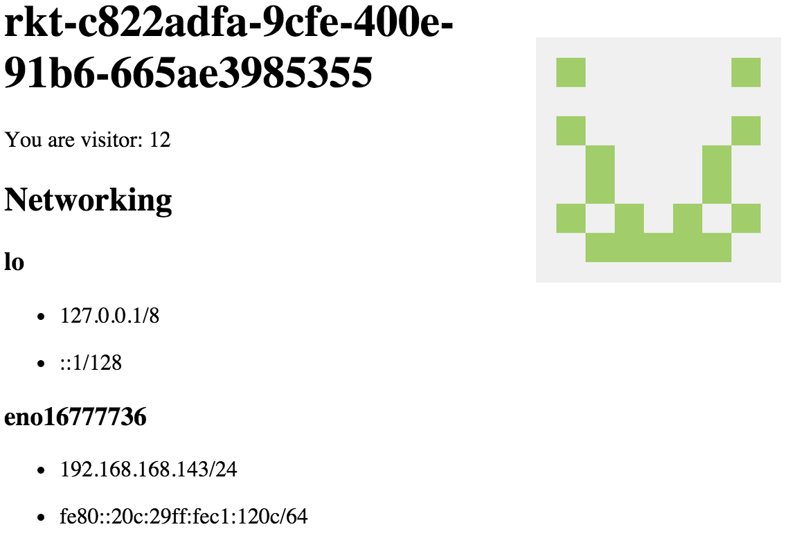

## Simple Host Info

[](https://quay.io/repository/philips/host-info)

Dumps the hostname, an identicon and networking info to an HTML page. Listens on http://localhost:5483/

```
/usr/bin/rkt --insecure-skip-verify \
	run https://github.com/philips/hacks/releases/download/v0/host-info.aci
```

Or try it out on AWS:

```
aws cloudformation create-stack \
	--template-body file:////`pwd`/coreos-host-info-pv.template  \
	--parameters ParameterKey=KeyPair,ParameterValue=philips ParameterKey=ClusterSize,ParameterValue=2 \
	--stack-name 'philips-host-info'
```


